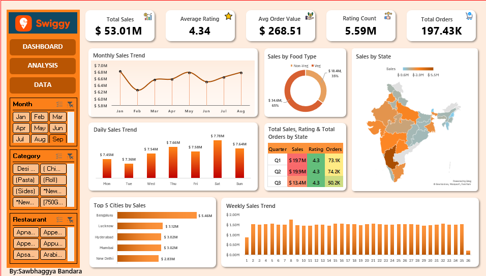

# Restaurant Sales & Customer Analytics Dashboard

## Project Overview

This project presents an interactive Restaurant Sales & Customer Analytics Dashboard developed entirely in Microsoft Excel. The dashboard analyzes more than 197,000 restaurant transactions and provides valuable insights into sales performance, customer preferences, restaurant operations, and regional business trends.

The objective of the project is to transform raw restaurant transaction data into actionable business intelligence through dynamic reporting and interactive visualizations.

---

## Dashboard Preview

---

## Dataset Information

The dataset contains **197,431 restaurant transaction records** with the following attributes:

| Column |
|----------|
| State |
| City |
| Order Date |
| Day |
| Quarter |
| Week |
| Restaurant Name |
| Location |
| Category |
| Dish Name |
| Food Type |
| Price ($) |
| Rating |
| Rating Count |

### Sample Record

| State | City | Restaurant | Category | Dish |
|---------|---------|---------|---------|---------|
| Karnataka | Bengaluru | Srinidhi Sagar Deluxe | Recommended | Chow Chow Bath |

---

## Dashboard KPIs

The dashboard provides key business metrics including:

- Total Sales: $53.01M
- Average Rating: 4.34
- Average Order Value: $268.51
- Rating Count: 5.59M
- Total Orders: 197.43K

---

## Features

### Sales Performance Analysis
- Monthly Sales Trend Analysis
- Daily Sales Trend Analysis
- Weekly Sales Trend Analysis
- Quarter-wise Performance Analysis

### Customer Insights
- Average Customer Ratings
- Rating Distribution Analysis
- Food Preference Analysis
- Order Volume Analysis

### Geographic Analysis
- State-wise Sales Distribution
- City-wise Sales Performance
- Regional Revenue Comparison

### Product Analysis
- Food Type Analysis (Veg vs Non-Veg)
- Category Performance Analysis
- Restaurant Performance Evaluation

### Interactive Dashboard Components
- Pivot Tables
- Pivot Charts
- KPI Cards
- Dynamic Slicers
- Geographic Maps
- Interactive Filtering

---

## Excel Skills Demonstrated

- Data Cleaning
- Data Preparation
- Data Validation
- Pivot Tables
- Pivot Charts
- Dashboard Design
- KPI Development
- Slicers
- Interactive Reporting
- Business Intelligence
- Data Visualization
- Conditional Formatting
- Aggregation Techniques

---

## Business Questions Answered

- Which states generate the highest sales?
- Which cities contribute the most revenue?
- What are the monthly and weekly sales trends?
- What is the average customer satisfaction level?
- Which food type is more popular?
- Which quarter performs best?
- Which restaurants contribute most to sales?

---

## Tools Used

- Microsoft Excel
- Pivot Tables
- Pivot Charts
- Slicers
- Excel Maps
- Data Visualization Techniques

---

## Key Outcomes

- Transformed 197K+ transaction records into actionable business insights.
- Built a fully interactive dashboard for sales and customer analytics.
- Enabled dynamic filtering and drill-down analysis.
- Improved decision-making through KPI-driven reporting.

Undergraduate | Data Science

University of Moratuwa
